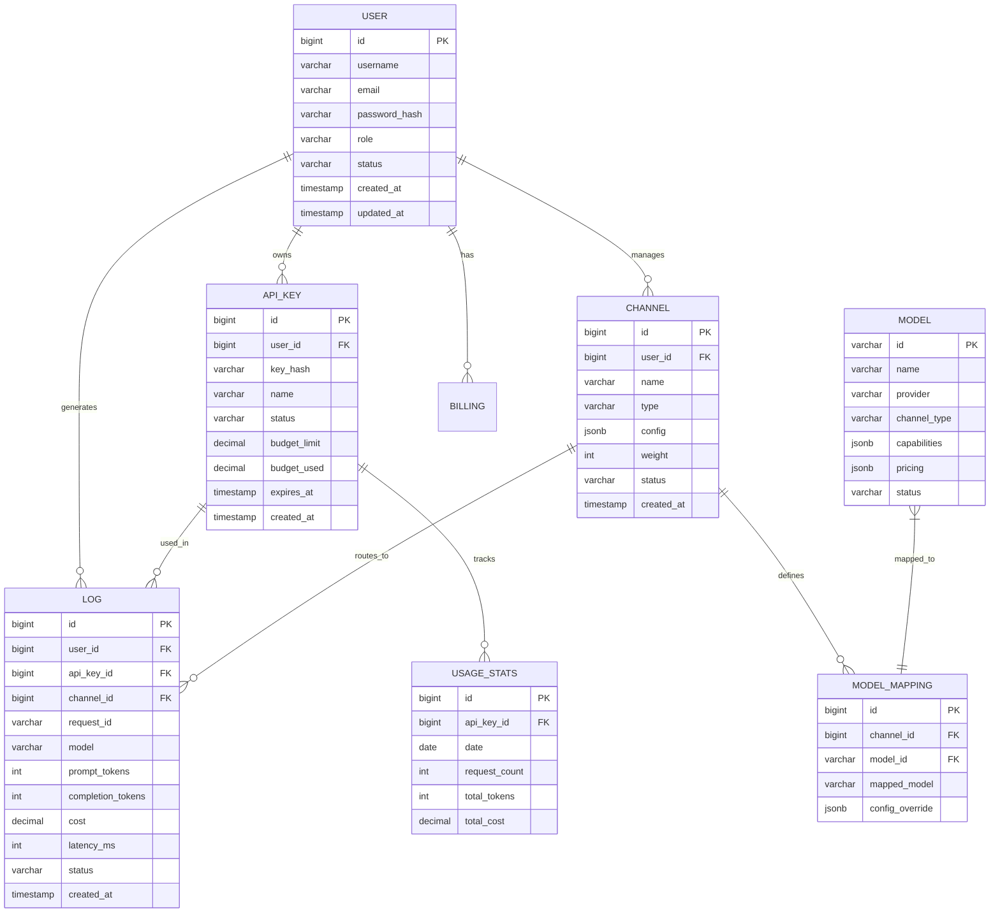

# 数据库设计文档

## 概览

- **数据库**: PostgreSQL 15+
- **ORM**: SQLAlchemy 2.0
- **迁移工具**: Alembic
- **字符集**: UTF-8

## 实体关系图



## 详细表结构

### 1. users (用户表)

| 字段名 | 类型 | 约束 | 说明 |
|--------|------|------|------|
| id | BIGINT | PK, Auto | 主键 |
| username | VARCHAR(50) | Unique, Not Null | 用户名 |
| email | VARCHAR(255) | Unique, Not Null | 邮箱 |
| password_hash | VARCHAR(255) | Not Null | 密码哈希 (bcrypt) |
| role | VARCHAR(20) | Default 'user' | 角色: admin/user |
| status | VARCHAR(20) | Default 'active' | 状态: active/inactive/banned |
| created_at | TIMESTAMP | Default now() | 创建时间 |
| updated_at | TIMESTAMP | Default now() | 更新时间 |

**索引**: email (唯一), username (唯一), status

### 2. api_keys (API密钥表)

| 字段名 | 类型 | 约束 | 说明 |
|--------|------|------|------|
| id | BIGINT | PK, Auto | 主键 |
| user_id | BIGINT | FK(users.id) | 所属用户 |
| key_hash | VARCHAR(255) | Unique, Not Null | API Key哈希 (sk-xxx) |
| name | VARCHAR(100) | | 密钥名称 |
| status | VARCHAR(20) | Default 'active' | 状态 |
| budget_limit | DECIMAL(15,4) | Default 0 | 预算上限 (0=无限制) |
| budget_used | DECIMAL(15,4) | Default 0 | 已使用预算 |
| rate_limit | INT | Default 60 | 每分钟请求限制 |
| allowed_models | JSONB | | 允许的模型列表 |
| ip_whitelist | JSONB | | IP白名单 |
| expires_at | TIMESTAMP | | 过期时间 |
| last_used_at | TIMESTAMP | | 最后使用时间 |
| created_at | TIMESTAMP | Default now() | 创建时间 |

**索引**: key_hash (唯一), user_id, status, expires_at

### 3. channels (渠道/上游配置表)

| 字段名 | 类型 | 约束 | 说明 |
|--------|------|------|------|
| id | BIGINT | PK, Auto | 主键 |
| user_id | BIGINT | FK(users.id) | 所属用户 (0=系统默认) |
| name | VARCHAR(100) | Not Null | 渠道名称 |
| type | VARCHAR(50) | Not Null | 类型: openai/anthropic/azure/etc |
| config | JSONB | Not Null | 配置详情 (API地址、密钥等) |
| weight | INT | Default 100 | 权重 (负载均衡) |
| priority | INT | Default 0 | 优先级 |
| status | VARCHAR(20) | Default 'active' | 状态 |
| is_system | BOOLEAN | Default false | 是否为系统渠道 |
| created_at | TIMESTAMP | Default now() | 创建时间 |
| updated_at | TIMESTAMP | Default now() | 更新时间 |

**索引**: user_id, type, status, priority

### 4. models (模型定义表)

| 字段名 | 类型 | 约束 | 说明 |
|--------|------|------|------|
| id | VARCHAR(100) | PK | 模型ID (如: gpt-4) |
| name | VARCHAR(200) | Not Null | 模型名称 |
| provider | VARCHAR(50) | Not Null | 提供商 |
| channel_type | VARCHAR(50) | Not Null | 渠道类型 |
| description | TEXT | | 描述 |
| capabilities | JSONB | | 能力: [chat, vision, function_calling] |
| context_window | INT | | 上下文窗口大小 |
| pricing_input | DECIMAL(10,6) | | 输入价格 (每1K tokens) |
| pricing_output | DECIMAL(10,6) | | 输出价格 (每1K tokens) |
| config | JSONB | | 额外配置 |
| status | VARCHAR(20) | Default 'active' | 状态 |
| created_at | TIMESTAMP | Default now() | 创建时间 |

**索引**: provider, channel_type, status

### 5. model_mappings (模型映射表)

| 字段名 | 类型 | 约束 | 说明 |
|--------|------|------|------|
| id | BIGINT | PK, Auto | 主键 |
| channel_id | BIGINT | FK(channels.id) | 所属渠道 |
| model_id | VARCHAR(100) | FK(models.id) | 模型ID |
| mapped_model | VARCHAR(100) | | 映射后的模型名称 |
| config_override | JSONB | | 配置覆盖 |
| is_enabled | BOOLEAN | Default true | 是否启用 |
| created_at | TIMESTAMP | Default now() | 创建时间 |

**索引**: channel_id, model_id

### 6. request_logs (请求日志表)

| 字段名 | 类型 | 约束 | 说明 |
|--------|------|------|------|
| id | BIGINT | PK, Auto | 主键 |
| request_id | VARCHAR(64) | Unique, Not Null | 请求唯一ID |
| user_id | BIGINT | FK(users.id) | 用户ID |
| api_key_id | BIGINT | FK(api_keys.id) | API Key ID |
| channel_id | BIGINT | FK(channels.id) | 使用的渠道 |
| model | VARCHAR(100) | Not Null | 请求的模型 |
| mapped_model | VARCHAR(100) | | 映射后的模型 |
| request_method | VARCHAR(10) | | HTTP方法 |
| request_path | VARCHAR(500) | | 请求路径 |
| request_headers | JSONB | | 请求头 (脱敏) |
| request_body | JSONB | | 请求体 (脱敏) |
| response_status | INT | | 响应状态码 |
| response_body | JSONB | | 响应体 |
| prompt_tokens | INT | Default 0 | 输入tokens |
| completion_tokens | INT | Default 0 | 输出tokens |
| total_tokens | INT | Default 0 | 总tokens |
| cost | DECIMAL(15,6) | Default 0 | 费用 |
| latency_ms | INT | | 延迟 (毫秒) |
| status | VARCHAR(20) | | 状态: success/error/timeout |
| error_message | TEXT | | 错误信息 |
| client_ip | INET | | 客户端IP |
| created_at | TIMESTAMP | Default now() | 创建时间 |

**索引**: 
- request_id (唯一)
- user_id, created_at
- api_key_id, created_at
- channel_id, created_at
- status, created_at
- created_at (按时间分区)

### 7. usage_stats (用量统计表)

| 字段名 | 类型 | 约束 | 说明 |
|--------|------|------|------|
| id | BIGINT | PK, Auto | 主键 |
| user_id | BIGINT | FK(users.id) | 用户ID |
| api_key_id | BIGINT | FK(api_keys.id) | API Key ID |
| date | DATE | Not Null | 日期 |
| hour | INT | | 小时 (0-23, 可选按小时统计) |
| request_count | INT | Default 0 | 请求数 |
| prompt_tokens | BIGINT | Default 0 | 输入tokens |
| completion_tokens | BIGINT | Default 0 | 输出tokens |
| total_tokens | BIGINT | Default 0 | 总tokens |
| total_cost | DECIMAL(15,4) | Default 0 | 总费用 |
| updated_at | TIMESTAMP | Default now() | 更新时间 |

**索引**: user_id, date; api_key_id, date

### 8. billing_records (账单记录表)

| 字段名 | 类型 | 约束 | 说明 |
|--------|------|------|------|
| id | BIGINT | PK, Auto | 主键 |
| user_id | BIGINT | FK(users.id) | 用户ID |
| type | VARCHAR(20) | Not Null | 类型: recharge/deduction/refund |
| amount | DECIMAL(15,4) | Not Null | 金额 |
| balance_before | DECIMAL(15,4) | | 变更前余额 |
| balance_after | DECIMAL(15,4) | | 变更后余额 |
| description | TEXT | | 描述 |
| reference_id | VARCHAR(100) | | 关联ID |
| created_at | TIMESTAMP | Default now() | 创建时间 |

**索引**: user_id, created_at; type, created_at

### 9. settings (系统设置表)

| 字段名 | 类型 | 约束 | 说明 |
|--------|------|------|------|
| id | BIGINT | PK, Auto | 主键 |
| key | VARCHAR(100) | Unique, Not Null | 设置键 |
| value | JSONB | | 设置值 |
| description | TEXT | | 说明 |
| updated_at | TIMESTAMP | Default now() | 更新时间 |

**索引**: key (唯一)

## 分区策略

### request_logs 表分区

按月份分区，便于数据归档和查询:

```sql
-- 按 created_at 范围分区
CREATE TABLE request_logs PARTITION BY RANGE (created_at);
CREATE TABLE request_logs_2024_01 PARTITION OF request_logs
    FOR VALUES FROM ('2024-01-01') TO ('2024-02-01');
-- 每月自动创建新分区
```

### usage_stats 表分区

按年份分区:

```sql
CREATE TABLE usage_stats PARTITION BY RANGE (date);
```

## 数据保留策略

| 表名 | 保留期 | 归档方式 |
|------|--------|----------|
| request_logs | 90天 | 导出到对象存储后删除 |
| usage_stats | 2年 | 压缩存储 |
| billing_records | 永久 | - |

## Redis 数据结构

### 1. 限流计数器

```
Key: ratelimit:{api_key_id}
Type: String
Value: 当前计数
TTL: 60秒
```

### 2. Token用量缓存

```
Key: usage:{api_key_id}:{date}
Type: Hash
Field: total_tokens, total_cost, request_count
TTL: 24小时
```

### 3. 渠道健康状态

```
Key: channel:health:{channel_id}
Type: Hash
Field: status, last_check, error_count
TTL: 300秒
```

### 4. 模型配置缓存

```
Key: model:config:{model_id}
Type: String (JSON)
TTL: 3600秒
```

### 5. 用户会话

```
Key: session:{token}
Type: Hash
Field: user_id, role, expires_at
TTL: 86400秒 (1天)
```
