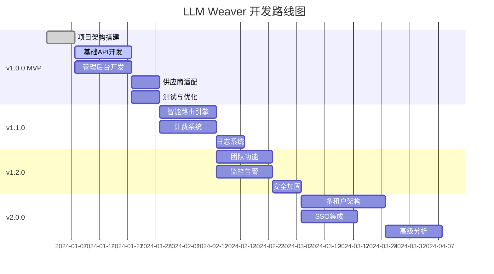

# 项目路线图

## 版本规划

### v1.0.0 - MVP (预计 4-6 周)

**目标**: 提供基础的API中转功能，支持主流供应商

#### 核心功能
- [x] 基础项目架构搭建
- [ ] OpenAI兼容接口 (/v1/chat/completions)
- [ ] 基础管理后台 (Vue3)
- [ ] 用户认证 (JWT)
- [ ] API Key管理
- [ ] 基础渠道管理
- [ ] 请求日志记录
- [ ] 供应商支持:
  - [ ] OpenAI
  - [ ] Anthropic
  - [ ] Azure OpenAI
  - [ ] Google Gemini
- [ ] Docker部署支持

#### 技术债务
- [ ] 完善错误处理
- [ ] 基础单元测试覆盖
- [ ] API文档 (Swagger)

---

### v1.1.0 - 智能路由与计费 (预计 3-4 周)

**目标**: 提供智能路由和基础计费功能

#### 新功能
- [ ] 智能路由引擎
  - [ ] 基于权重的负载均衡
  - [ ] 健康检查与故障转移
  - [ ] 路由策略配置
- [ ] 费用统计系统
  - [ ] Token用量统计
  - [ ] 费用计算
  - [ ] 用量报表
- [ ] 预算控制
  - [ ] API Key级别预算限制
  - [ ] 预警通知
- [ ] 高级日志
  - [ ] 日志搜索与过滤
  - [ ] 日志导出
- [ ] 新增供应商:
  - [ ] Mistral AI
  - [ ] Cohere
  - [ ] 智谱AI

#### 优化
- [ ] 性能优化 (连接池、缓存)
- [ ] 前端UI优化
- [ ] 更多测试覆盖

---

### v1.2.0 - 企业级功能 (预计 4-5 周)

**目标**: 提供企业级管理和监控能力

#### 新功能
- [ ] 团队/组织功能
  - [ ] 多用户管理
  - [ ] 角色权限 (RBAC)
  - [ ] 团队资源隔离
- [ ] 监控告警
  - [ ] Prometheus集成
  - [ ] Grafana仪表板
  - [ ] 告警规则配置
- [ ] 高级安全
  - [ ] IP白名单
  - [ ] 请求签名
  - [ ] 审计日志
- [ ] 新增供应商:
  - [ ] 文心一言
  - [ ] 通义千问
  - [ ] Ollama (本地模型)
  - [ ] vLLM (本地模型)
- [ ] 模型映射与转换

#### 优化
- [ ] 数据库查询优化
- [ ] 缓存策略优化
- [ ] 文档完善

---

### v2.0.0 - 多租户与SaaS (预计 6-8 周)

**目标**: 支持多租户架构，提供SaaS服务能力

#### 新功能
- [ ] 多租户架构
  - [ ] 租户隔离
  - [ ] 租户级别配置
  - [ ] 租户计费
- [ ] 企业级SSO
  - [ ] LDAP集成
  - [ ] SAML支持
  - [ ] OIDC支持
- [ ] 高级分析
  - [ ] 用量预测
  - [ ] 成本分析
  - [ ] 自定义报表
- [ ] API网关功能
  - [ ] 速率限制 (高级)
  - [ ] 请求转换
  - [ ] 缓存层
- [ ] 开发者门户
  - [ ] 交互式文档
  - [ ] SDK下载
  - [ ] Playground

#### 技术升级
- [ ] 微服务架构 (可选)
- [ ] Kubernetes原生支持
- [ ] 服务网格集成

---

### v2.1.0 - 生态与扩展 (预计 4-6 周)

**目标**: 构建生态系统，支持插件和扩展

#### 新功能
- [ ] 插件系统
  - [ ] 自定义供应商插件
  - [ ] 中间件插件
  - [ ] 计费插件
- [ ] Webhook系统
  - [ ] 事件通知
  - [ ] 自定义处理
- [ ] 内容安全
  - [ ] 敏感词过滤
  - [ ] 内容审核集成
- [ ] 高级缓存
  - [ ] 响应缓存
  - [ ] 语义缓存
- [ ] CLI工具
  - [ ] 管理命令
  - [ ] 配置管理

---

## 技术债务跟踪

### 当前债务

| 项目 | 优先级 | 计划版本 | 状态 |
|------|--------|----------|------|
| 完善单元测试 | 高 | v1.0.0 | 进行中 |
| API文档完善 | 高 | v1.0.0 | 待开始 |
| 错误码统一 | 中 | v1.1.0 | 待开始 |
| 数据库索引优化 | 中 | v1.1.0 | 待开始 |

---

## 里程碑

---

## 长期愿景

### 2024 Q1-Q2: 基础平台
- 稳定的基础功能
- 主流供应商全覆盖
- 企业级安全与监控

### 2024 Q3-Q4: 企业级功能
- 多租户SaaS平台
- 高级分析与优化
- 开发者生态

### 2025: 智能化平台
- AI驱动的路由优化
- 自动成本优化
- 智能缓存策略
- 预测性分析

---

## 优先级矩阵

### 重要且紧急 (P0)
- 基础API功能
- 核心供应商支持
- 认证授权
- 基础监控

### 重要不紧急 (P1)
- 智能路由
- 详细计费
- 团队功能
- 高级安全

### 不重要但紧急 (P2)
- UI美化
- 额外供应商
- 文档完善

### 不重要不紧急 (P3)
- 开发者门户
- CLI工具
- 插件市场
